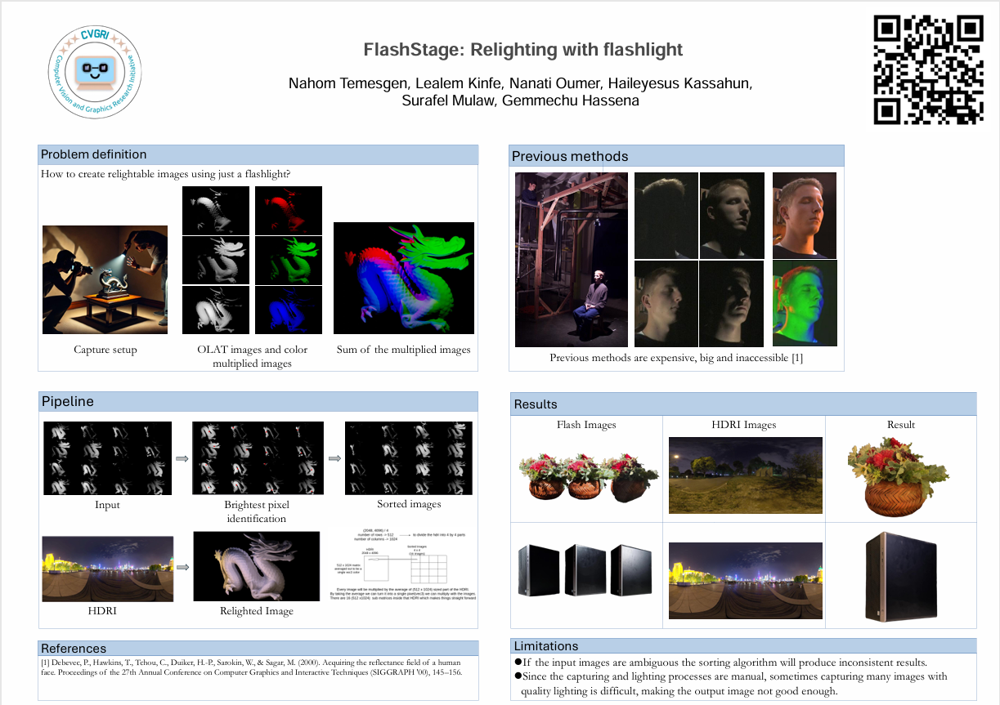
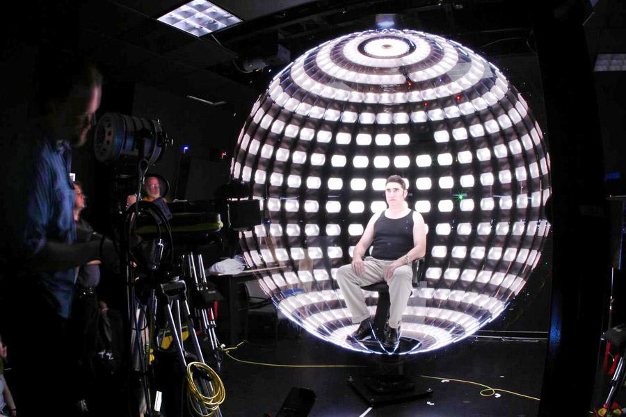
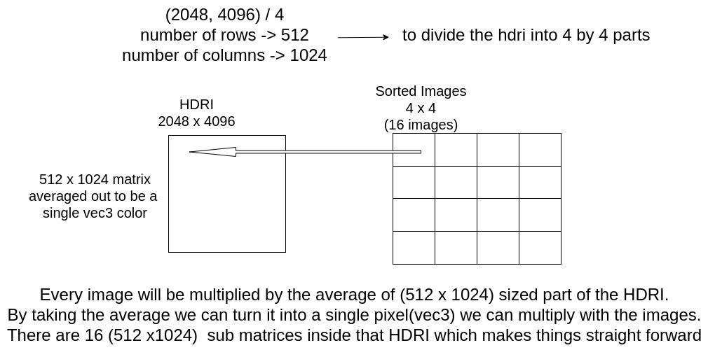
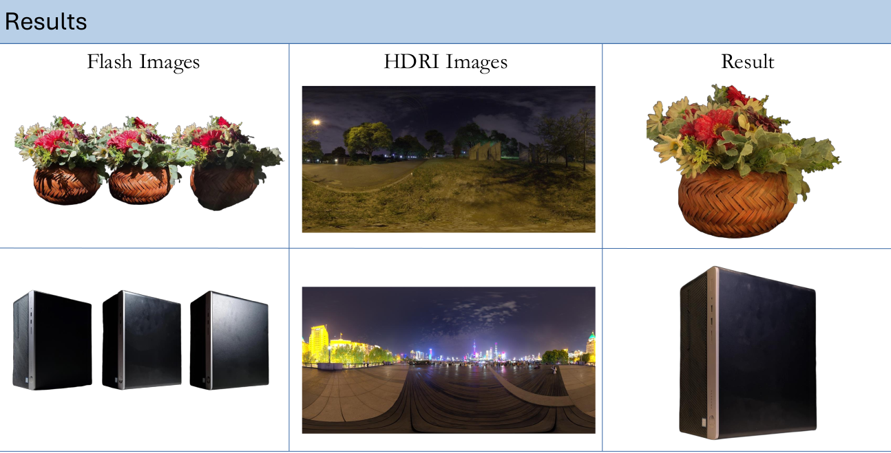

# FlashStage: Image-based relighting with a flashlight

The film and gaming industries have leveraged cutting-edge technologies for years to achieve stunning realism in digital characters and environments. One such tool is the Light Stage, a sophisticated setup used to capture how light interacts with a subject's face from all directions. This data enables incredibly realistic relighting of faces in post-production, allowing characters to blend seamlessly into any scene. While the results are extraordinary, the Light Stage's complexity and cost have largely confined it to high-budget productions in Hollywood.

At FlashStage, we asked ourselves a simple question: What if this powerful technology could be reimagined in a way that’s affordable, accessible, and easy to use? Could we create a solution that brings professional-grade relighting capabilities into the hands of researchers, developers, and artists worldwide? The answer is a resounding yes!

## **The Previous Method**

The Light Stage, developed at the University of Southern California, uses a dome-like structure fitted with dozens (or even hundreds) of LED lights and high-speed cameras. The system captures intricate details about how their skin reflects and scatters light by illuminating a subject with precisely controlled light patterns. This data is essential for creating digital doubles or relighting the subject to match any environment.

While the results are building and operating a Light Stage is a daunting task. It requires specialized hardware, precise calibration, and substantial funding. This exclusivity inspired us to rethink the process from the ground up.



## **Our Method**

FlashStage aims to democratize relighting by creating a streamlined solution that delivers impressive results without bulky hardware or expensive setups. By using everyday tools such as a standard flashlight and a single camera our method captures the key elements required for relighting. Here’s how it works:

### **1. ****Data**** Collection with a Flashlight**

Instead of a dome filled with LEDs, we use a single flashlight to illuminate the subject from different angles. This simplified approach dramatically reduces costs and complexity.

- **Manual Capture Process:** A flashlight is used to illuminate the subject from multiple angles while a camera captures images. The subject and camera remain stationary to ensure alignment across frames.

- **Key Considerations for Consistency:**

- Maintain uniform movement and distance of the flashlight.

- Ensure stable positioning of the subject and camera.

This low-cost and portable method is ideal for fieldwork or environments with limited resources.

### **2. ****Image**** Bright Pixel Identification and Sorting**

#### <span style="text - decoration: underline;">General Process</span>

We start by converting every image into an array of pixel colors. This means for every pixel we will have a 2 dimensional index we can traverse and access with.

The way we calculate the brightest pixel is by computing the weighted average between the indices of the pixels and their magnitude as weight. For every image, we store it inside a dictionary with the image path as key and the identified bright pixel’s index as the value.

After the bright pixel is identified we proceed to the sorting phase. The images should be sorted in a matrix format to work with environmental lights. For instance, if we have 16 images we will sort them to form a 4x4 matrix.

The sorting algorithm takes in a column value as one of the arguments, the other being a list of dictionaries(key: image path, value: brightest pixel’s index). The algorithm begins by sorting all the elements in the list based on the row value of the brightest pixel’s index. After this initial sorting, the list is divided into smaller groups, where the size of each group matches the column count provided as input. This step simplifies converting the list into a matrix format. Finally, within each group (or row of the matrix), the elements are sorted again, this time based on the column value of their brightest pixel’s index.

The detailed breakdown is given next.

#### <span style="text - decoration: underline;">Brightest Pixel Identification</span>

Each captured frame undergoes analysis to identify the brightest pixel corresponding to the primary light source's direction. This process ensures the images are organized in a structured sequence, facilitating accurate alignment for relighting.

The algorithm to find the brightest pixel is based on the magnitude of the pixel's RGB values. The process can be mathematically described as:


where R, G, and B are the red, green, and blue components of a pixel.

2. Filter out pixels below a certain brightness threshold T:


Only pixels satisfying the condition are retained for further analysis.

3. Calculate the weighted centroid of the bright pixels, where the weight is the pixel brightness:


This yields the average position (Centroid~x~​, Centroid~y~​) of the brightest area.

4. Convert the computed coordinates to an integer to obtain the pixel with the brightest location since we’re working with the index of the pixel.

#### <span style="text - decoration: underline;">Sorting Images Based on Light Source Directions</span>

##### After identifying the brightest pixel in each image, the images are sorted in a matrix form to align with the light source directions:

1. **Row Sorting**:

    - Sort the images based on the y-coordinate of their brightest pixel (light source position).

    - Selection sort is used for simplicity:

    - Iterate over the array and find the minimum x-coordinate in the unsorted part.

    - Swap the current image with the image at the minimum position.

2. **Column Sorting**:

    - After row sorting, each row of the matrix is sorted based on the x-coordinate of the brightest pixel.

    - Again, selection sort is applied within each row.

###### Pseudocode

```
Brightest Pixel Identification:
    Input: Image
    Convert image to RGB array
    Compute magnitude of each pixel: sqrt(R^2 + G^2 + B^2) / 255
    Apply threshold: keep pixels with magnitude >= T
    Compute weighted centroid using pixel magnitudes as weights
    Return rounded centroid coordinates as the brightest pixel

Image Sorting:
    Input: List of images with their brightest pixel coordinates
    Sort images by row index (y-coordinate) using selection sort
    Group images into rows
    For each row:
        Sort images by column index (x-coordinate) using selection sort
    Return sorted image matrix
```
### **3. Two Approaches for Relighting Images**

FlashStage employs two methods to achieve realistic relighting:

- **Approach 1: HDRI-Based Relighting**

    - Dividing HDRI into grids: The HDRI is divided into smaller patches, each representing a portion of the environmental light source.

    - Multiplying image pixels with HDRI colors: The corresponding HDRI patch’s average color is applied to simulate environmental lighting for each sorted image.

    - Compositing: Modified images are combined to create a final relighted image, matching the lighting conditions captured in the HDRI.

        

- **Approach 2: Resized Environmental Lighting-Based Relighting**

    - Resizing environmental lighting: The lighting image is resized to match the grid size (e.g., 6x4 grid).

    - Pixel-level multiplication: Each captured image is multiplied by the corresponding pixel value from the resized environmental lighting image.

    - Output: The resulting images show how the subject’s face would look under different lighting conditions.

        

## **Results**

FlashStage demonstrated promising results in creating relightable images with minimal equipment. Key findings include:

- **Cost-Effective Outputs:** High-quality relighting results were achieved using simple tools like a flashlight and camera.

- **Limitations:** The manual nature of the setup introduced variability, and the algorithm occasionally struggled with ambiguous inputs.

- **Comparison with Light Stage:** While FlashStage doesn’t match the precision of a full Light Stage, it offers an affordable and portable alternative suitable for many applications.

Visual examples of the outputs show the progression from raw captures to relighted images, highlighting the pipeline’s effectiveness.



## **Discussion**

#### **What Improvements Are Being Made?**

- **Automated Capture Tools**: Ensuring smooth and consistent flashlight movement.

- **Smarter Algorithms**: Making image sorting more accurate.

- **Better Relighting Models**: Using advanced techniques to handle tricky lighting conditions.

- **Easy-to-Use Software**: Creating simple tools for everyone, even non-experts.

#### **What Are the Limitations?**

- **Less Precision**: The manual flashlight setup isn’t as accurate as a professional Light Stage.

- **Inconsistent Results**: Variations in how the flashlight is used can cause issues.

- **Small-Scale Use**: It’s great for smaller projects but may not handle very detailed or complex needs.

#### **Why It Matters**

FlashStage is about simplifying technology and making it accessible to everyone. Imagine educational researchers using relighting to create realistic virtual tutors or independent game developers crafting lifelike characters without breaking their budgets. The potential applications extend to healthcare, cultural preservation, and even social media.

By lowering the barrier to entry, FlashStage empowers innovators across industries to harness the power of object relighting. We believe this democratization will spark a new wave of creativity and innovation, much like how smartphones and affordable cameras revolutionized photography

#### **What’s Next?**

Interested in learning more or collaborating with us? Reach out to our team, and let’s bring the magic of relighting to the world!

Nahom T. Retebeo - [Linkedin](http://linkedin.com/in/nahomtemesgen)

Lealem K. Alula - [Linkedin](https://www.linkedin.com/in/lealem-kinfe/)

Nanati Oumer - [Linkedin](https://www.linkedin.com/in/nanati-oumer-7133631b0/)

Haileyesus K. Dessie - [Linkedin](https://www.linkedin.com/in/haileyesus-dessie-677a86222/)

#### ***<span style="text - decoration: underline;">Our Incredible Mentors</span>***

Gemmechu Hassena - [Linkedin](https://gemmechu.github.io/)

Surafel K. Mulaw - [Linkedin](https://www.linkedin.com/in/surafelk/)
